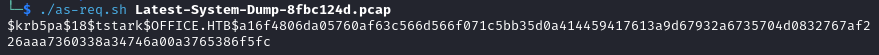

# scripts-collection

This is a repository for all the scripts I'll find useful while I'm learning scripting with Bash, PowerShell and Python

## icecast.py (CVE-2004-1561)

The original script is available here: https://github.com/ivanitlearning/CVE-2004-1561/blob/master/icecast.py

I had to modify it to make it work for Python3
* I modified lines 49 and 50 to fix bytes concatenation
* I modified line 54 to remove encoding
* You need to setup a listener. Eg. `nc -nlvp 443`

## nmap_scan.sh

To use the script, follow this example: 

```
./nmap_scan.sh <target_ip> <output_file_name>
```

## as_req.sh

This script will extract a Kerberos hash from a pcap file containing Kerberos Pre-Authentication packets. The extracted hash will be crackable with module 19900 of hashcat. All you need to do is to provide a pcap file. Example:

```
as_req.sh <pcap file>
```



## C2_extract.py

I used this script for the room [SeeTwo](https://tryhackme.com/r/room/seetworoom) on TryHackMe. Just run:

```
python3 C2_extract.py
```


